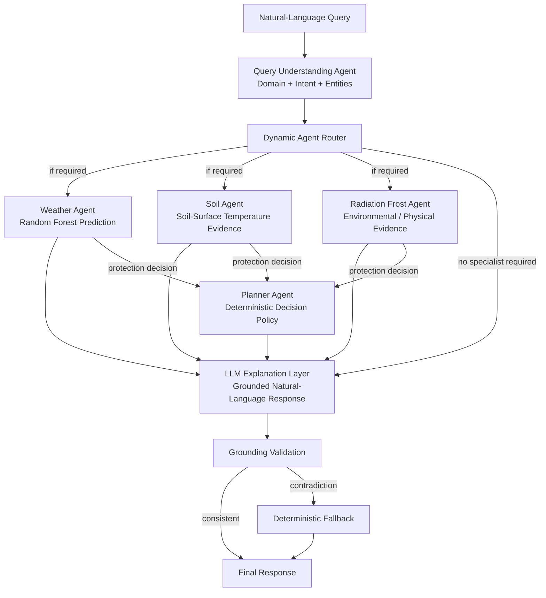
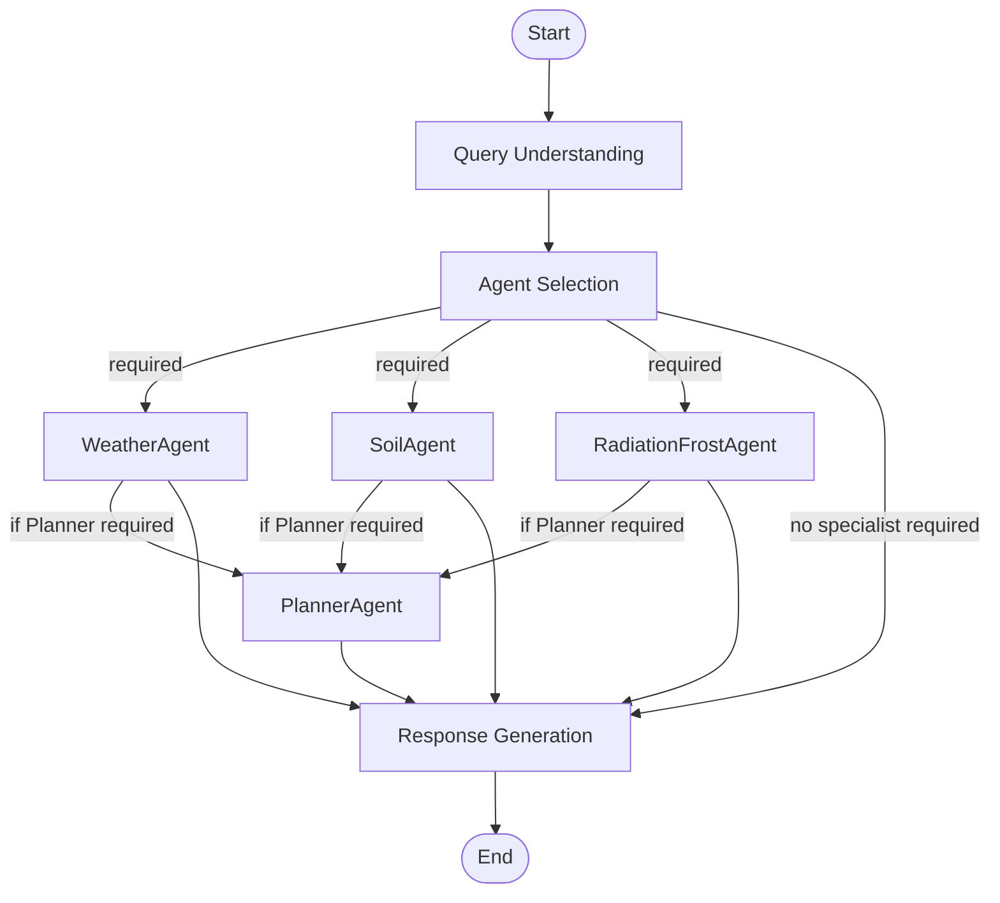
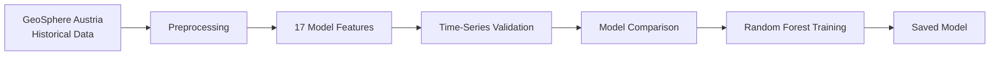
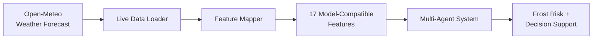
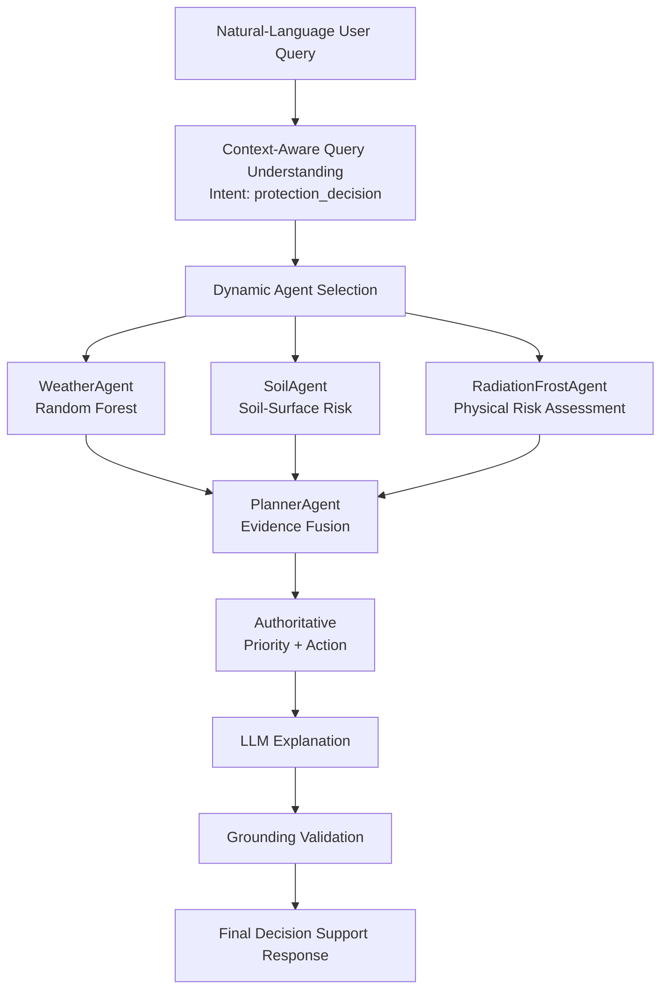
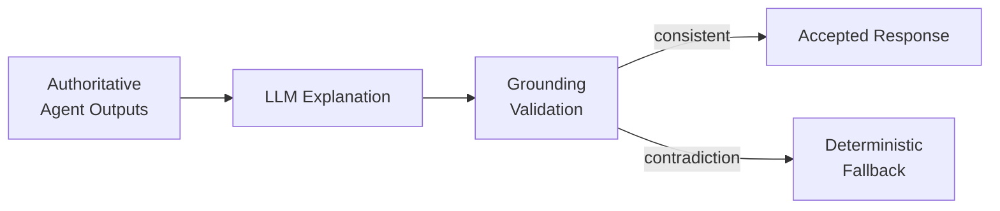

# Multi-Agent Frost Prediction and Decision Support System

A context-aware agentic AI system for frost-risk prediction and agricultural decision support. It combines a trained Random Forest model, specialist environmental agents, deterministic planning, LangGraph orchestration, live weather forecasts, and grounded LLM reasoning to answer natural-language questions such as:

```text
Will frost occur tomorrow?
What is the soil condition?
Should I activate frost protection tonight?
```

> **The LLM does not make the authoritative frost prediction or protection decision.**
> Prediction and decision logic are handled by the ML model and deterministic agents. The LLM supports natural-language understanding and grounded explanation, while LangGraph manages conditional multi-agent execution. LLM-generated explanations are validated against authoritative results before being returned.

This separates concerns that are often bundled into a single model or a single prompt: **ML prediction, environmental assessment, context understanding, multi-agent routing, decision policy, and grounded explanation** are each independently implemented and independently testable.

---

## Architecture

| Layer | Role |
|---|---|
| Machine Learning | Random Forest estimates frost probability |
| Multi-Agent System | Specialist agents independently assess different aspects of frost risk |
| Query Understanding | Detects domain, intent, entities, and time context from the raw question |
| Dynamic Routing | Activates only the agents required for the current request |
| LangGraph | Maintains shared state and controls conditional execution |
| Deterministic Planning | `PlannerAgent` converts evidence into an operational recommendation |
| Generative AI | Local Gemma 3 (via Ollama) produces grounded human-readable explanations |
| Grounding Guardrail | LLM output is checked against authoritative results; falls back to a deterministic report on contradiction |
| Live Data | Open-Meteo forecasts drive operational inference |



Not every agent runs for every request: the routing path depends on the meaning of the question.

---

## Query Understanding and Routing

`QueryUnderstandingAgent` classifies each request into a `domain`, `intent`, and set of `entities` (e.g. `time_reference: "tonight"`) before any computational agent runs. Classification is deterministic where possible, falling back to the local LLM for ambiguous phrasing. `LLMRouterAgent` then maps that classification to the exact set of agents required:

| Intent | Domain | Agents Activated |
|---|---|---|
| `frost_prediction` | frost | WeatherAgent, SoilAgent |
| `soil_assessment` | frost | SoilAgent |
| `radiation_frost_assessment` | frost | RadiationFrostAgent |
| `protection_decision` | frost | WeatherAgent, SoilAgent, RadiationFrostAgent, PlannerAgent |
| `frost_explanation` | frost | None (conceptual, no analysis needed) |
| `greeting` | general_conversation | None |
| `out_of_scope` | out_of_scope | None |

This keeps unrelated agents from running and keeps each agent's responsibility explicit. `test_query_understanding.py` and `test_agent_routing.py` cover this table directly.

### LangGraph Orchestration

LangGraph is the runtime orchestration layer: it carries shared state (question, query understanding, required agents, each agent's output, final response) and conditionally executes only the nodes a given request needs.



---

## Agents

| Agent | Input | Output | Role |
|---|---|---|---|
| `WeatherAgent` | 17-feature model row | `frost_probability`, `frost_prediction` | Random Forest inference (`models/random_forest_frost_model.pkl`) |
| `SoilAgent` | Soil-surface temperature | `soil_risk` (low/medium/high) | Independent soil-surface evidence channel |
| `RadiationFrostAgent` | Min. temp, wind, cloud cover, soil temp | `risk_level` (LOW/MEDIUM/HIGH) | Physically motivated radiation-frost assessment |
| `PlannerAgent` | Outputs of the three agents above | `priority`, `recommended_action`, `evidence_status` (AGREEMENT/MIXED) | Deterministic policy fusing specialist evidence; **owns the operational recommendation**, not the LLM |
| `LLMOrchestrator` (explanation layer) | Agent + planner outputs | Natural-language explanation | Explains already-computed results using `gemma3:1b` via Ollama (configured in `src/config.py`); never recalculates or overrides them |

`PlannerAgent`'s possible recommendations: *No immediate action required* / *Monitor conditions closely and prepare frost-protection measures* / *Activate frost protection*. See `src/agents/planner_agent.py` for the exact evidence-fusion policy.

---

## Model Development and Live Inference

Model development (offline, using historical data) and operational inference (online, using forecasts) are deliberately separate pipelines:





The model is trained once, offline, and is **not retrained per request**.

Because Open-Meteo and GeoSphere Austria do not expose identical variables, `src/data_pipeline/feature_mapper.py` maps operational forecasts to the model's 17-feature schema. Non-equivalent mappings are explicitly documented as derived or proxy features.

In particular, `near_ground_temp_min` is a model-input proxy for the historical GeoSphere `tsmin` variable. Open-Meteo `soil_temperature_0cm` is kept separate as `radiation_soil_temp_min` and provides soil-surface evidence to the Soil and Radiation Frost agents.

### Historical Dataset

| Property | Value |
|---|---|
| Station | Graz Universität / Heinrichstraße |
| Latitude / Longitude | 47.077° N / 15.449° E |
| Elevation | 366 m |
| Historical period | 2000-01-01 → 2026-04-18 |
| Observations | 9,240 |
| Frost rate | 14.74% (1,362 frost / 7,878 non-frost) |

The target (`reif`, internally `frost`) is the station's recorded frost observation, not a derived rule such as `temp_min <= 0`.

### Model Features (17)

```text
temp_min, temp_max, temp_mean, near_ground_temp_min, humidity_mean,
vapor_pressure_mean, pressure_mean, cloud_morning, cloud_afternoon,
precipitation, visibility_morning, visibility_afternoon, dew, fog,
wind_bft6, wind_bft8, max_wind_gust
```

### Model Evaluation

Chronological 5-fold `TimeSeriesSplit` comparison (`python3 -m src.test.test_model_validation`):

| Model | ROC-AUC | Precision | Recall | F1 |
|---|---:|---:|---:|---:|
| Logistic Regression | 0.9575 | 0.5493 | **0.9428** | 0.6920 |
| **Random Forest** | **0.9642** | **0.7077** | 0.7461 | **0.7247** |

Random Forest is used as the operational model because it achieved the stronger overall ROC-AUC, precision, and F1 balance in the chronological validation.

---

## Example: End-to-End Workflow

For an operational decision-support question (`Should I activate frost protection tonight?`), the full path from query to response:



---

## Grounding and Guardrails

Generated explanations are validated against authoritative agent output before being returned; a contradiction (e.g. reclassifying a risk level, reversing the frost prediction, dropping the planner's recommendation) is rejected in favor of a deterministic report built from the same data.



---

## Project Structure

```text
multi-agent-frost-prediction-system/
│
├── README.md
├── requirements.txt
│
├── data/raw/                               Historical GeoSphere Austria dataset
├── models/                                 Trained Random Forest + sample rows
├── notebooks/data_exploration.ipynb
│
└── src/
    ├── config.py
    ├── main.py
    │
    ├── agents/
    │   ├── llm_orchestrator.py
    │   ├── llm_router_agent.py
    │   ├── planner_agent.py
    │   ├── query_understanding_agent.py
    │   ├── radiation_frost_agent.py
    │   ├── soil_agent.py
    │   └── weather_agent.py
    │
    ├── data_pipeline/
    │   ├── feature_mapper.py
    │   ├── live_data_loader.py
    │   ├── preprocess_data.py
    │   └── retrain_model.py
    │
    ├── graph/frost_graph.py
    │
    └── test/
```

---

## Tech-Stack

- Python
- pandas
- scikit-learn (Random Forest)
- LangGraph
- Ollama (Gemma 3)
- GeoSphere Austria
- Open-Meteo API

---

## Installation

```bash
git clone <repository-url>
cd multi-agent-frost-prediction-system

python3 -m venv .venv
source .venv/bin/activate
#windows: .\.venv\Scripts\Activate.ps1

pip install -r requirements.txt

ollama pull gemma3:1b
```

---

## Running the System

```bash
python3 -m src.main
```

Example questions:

```text
Will frost occur tomorrow?
What is the soil condition?
Should I activate frost protection tonight?
Explain radiation frost.
```

## Running Tests

```bash
#full pytest suite
pytest src/test -v

#system-validation runner
python3 -m src.test.run_all_tests

#individual validation suites
python3 -m src.test.test_model_validation
python3 -m src.test.test_query_understanding
python3 -m src.test.test_agent_routing
python3 -m src.test.test_graph_routing
python3 -m src.test.test_planner_policy
python3 -m src.test.test_synthetic_scenarios
python3 -m src.test.test_full_pipeline
```

| Test Module | Covers |
|---|---|
| `test_model_validation.py` | Chronological model comparison; regression-guards the RF vs. LR tradeoff above |
| `test_query_understanding.py` | Domain/intent/entity classification |
| `test_agent_routing.py` | Intent → required-agents mapping |
| `test_graph_routing.py` | LangGraph execution paths per intent |
| `test_planner_policy.py` | Deterministic planner decision policy |
| `test_synthetic_scenarios.py` | Controlled frost-risk scenarios (agreement/conflict between agents) |
| `test_frost_comparison.py` | Learned vs. radiation-frost risk agreement |
| `test_full_pipeline.py` | End-to-end LangGraph pipeline, including that unnecessary agents don't run |

Tests that require a local Ollama server or live internet access (Open-Meteo) skip automatically, with a reason, when those aren't reachable; the rest of the suite runs fully offline.

---

## Limitations

This is a **research decision-support prototype**, not a certified agricultural protection system.

1. **Single-station model**: trained on Graz Universität observations only; not validated for other locations.
2. **Training-serving distribution shift**: training uses GeoSphere observations, inference uses Open-Meteo forecasts.
3. **Feature proxies**: several live variables are derived/proxy mappings, not exact measurement equivalents (documented in `feature_mapper.py`).
4. **Historical validation ≠ live forecast validation**: the metrics above measure held-out historical performance, not live forecast accuracy.
5. **Simplified specialist rules**: Soil/RadiationFrost assessments are complementary signals, not complete physical or agronomic models.
6. **LLM variability**: explanations may occasionally drift; grounding validation and deterministic fallback exist specifically for this.
7. **Cost-sensitive threshold choice**: Random Forest wins on precision/F1, Logistic Regression on recall; the right operational threshold depends on the real cost of a missed frost event vs. a false alarm.

---

## Acknowledgement

This project was conducted with the resources of:

- Know Center Research GmbH

We also acknowledge to the data sources:

- GeoSphere Austria
- Open-Meteo

---

## Author

**Saiful Islam**

- MSc in Computer Science (Data Science) - TU Graz

---

## Project Supervisor

**Dr. Lucas Iacono**

- Research Area Manager - Data Management for AI
- Know Center Research GmbH

---

## License

No license has currently been specified for this repository.